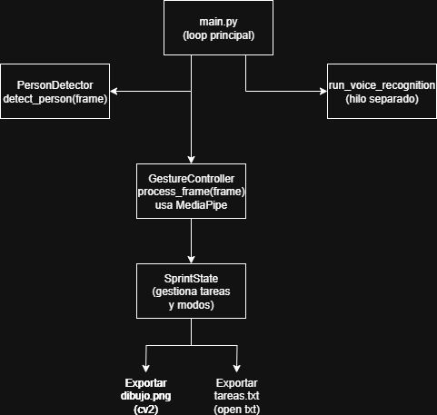

# Informe Final – Sistema de Interacción Visual sin Contacto

### Datos de la estudiante

-   **Nombre completo:** María Fernanda Cala Rodríguez
    
-   **Número de documento:** 1027522940
    
-   **Correo institucional:** mcalar@unal.edu.co
      

## 🧩 Requisitos del Proyecto

### 1. 📌 Definición del Problema

En entornos donde se llevan a cabo reuniones de equipo, clases o actividades colaborativas, es común depender de interfaces físicas (teclados, mouse, pantallas táctiles) para interactuar con contenidos digitales. Sin embargo, existen escenarios donde el uso de estas interfaces no es práctico, ya sea por razones de accesibilidad, higiene o conveniencia.

Este sistema se concibió pensando en su aplicación dentro de **metodologías ágiles**, donde la **rapidez**, la **adaptabilidad** y la **colaboración** son fundamentales. Al eliminar la necesidad de contacto físico con los dispositivos, facilitamos interacciones más fluidas y dinámicas en reuniones de equipo, sesiones de _brainstorming_ o presentaciones interactivas. La capacidad de controlar la interfaz con **gestos y comandos de voz** permite a los usuarios interactuar con el contenido de manera más natural y eficiente, reduciendo fricciones y optimizando el tiempo, elementos clave para mantener la agilidad en cualquier proyecto.

Este proyecto busca diseñar un sistema que permita controlar funciones básicas como cambiar de vista, dibujar, mover objetos o ejecutar acciones mediante **interacción visual sin contacto**, utilizando una cámara y comandos de voz.

El problema es relevante dentro del campo de la **computación visual** porque permite aplicar técnicas avanzadas de detección de objetos, seguimiento de manos, análisis de gestos y reconocimiento de voz en tiempo real. Además, promueve el desarrollo de interfaces naturales y accesibles que responden al entorno y al usuario sin necesidad de contacto físico.

----------

### 2. 🧠 Selección de Talleres

Se integran cinco (5) talleres desarrollados durante el curso:

**2025-06-21_taller_sistema_monitoreo_inteligente_vision_dashboard**
Para detectar si hay una persona y activar/desactivar la interfaz

**2025-05-17_taller_gestos_webcam_mediapipe**
Para implementar el manejo de interfaz con gestos.

**2025-05-24_taller_reconocimiento_voz_local**
Para tener una manera de escribir sin contacto se utiliza la voz.

**2025-06-18_taller_pintura_interactiva_voz_gestos**
Para implementación de formas para dibujar con gestos.

**2025-06-23_taller_monitor_visual_3d_integracion_python**
Para seguimiento de las manos.

**Técnicas y herramientas utilizadas:**

-   Modelo **YOLOv8** (versión ligera `yolov8n.pt`) para detección de personas.
    
-   Biblioteca **`MediaPipe`** para reconocimiento de manos y gestos.
    
-   **`SpeechRecognition`** y **`pyttsx3`** para entrada y salida por voz.
    
-   **`OpenCV`** para la manipulación de video, visualización y gráficos.
    
-   Programación modular en Python con estructuras separadas por función.
    

----------

### 3. 🏗️ Arquitectura de Solución

#### Descripción General

El sistema está compuesto por cuatro módulos principales que trabajan de forma concurrente:

1.  **Captura de video** desde la webcam, gestionada por el módulo principal (`main.py`).
    
2.  **Detección de personas** con YOLOv8 para activar o desactivar la interfaz.
    
3.  **Reconocimiento de gestos** con MediaPipe para cambiar de modo, seleccionar objetos, dibujar.
    
4.  **Reconocimiento de voz** para escribir de forma alternativa sin necesidad de contacto.

----------

### Enlace al video

https://www.youtube.com/watch?v=NSueTlPPVJg

### Explicación técnica del funcionamiento

-   `main.py` administra la captura de video y coordina los módulos.
    
-   `detection.py` emplea YOLOv8 para identificar personas en la escena.
    
-   `gesture_control.py` gestiona el cambio de escenas y acciones visuales mediante gestos.
    
-   `voice_control.py` ejecuta reconocimiento de voz cada ciertos segundos y realiza retroalimentación hablada.
    
### Evidencia de funcionamiento

Crear nueva tarea y dictado por voz:

Marcar tarea como completada y eliminar:

Modo dibujo:

Editar tarea:

Inactividad/Reactivar al detectar persona:

### Conclusiones y reflexiones personales

Este proyecto integró múltiples conceptos y herramientas vistas en clase, permitiendo desarrollar un sistema que responde a estímulos visuales y auditivos sin necesidad de contacto físico.

Además de reforzar conocimientos en visión por computadora, redes neuronales y procesamiento de video, se aprendió a estructurar un sistema modular, reutilizable y eficiente en tiempo real.

La experiencia fue valiosa tanto desde el punto de vista técnico como en términos de diseño de interfaces accesibles y prácticas para entornos reales.
